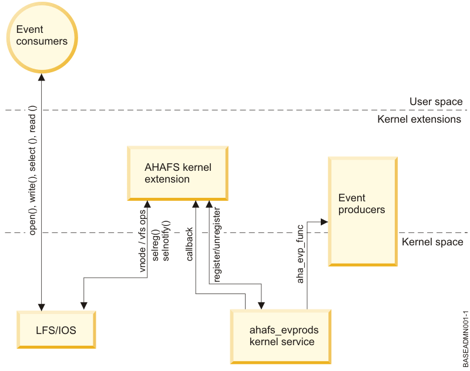

Filesmon - monitor files event on AIX
=====================================
| OS Version   |
|:--------------:|
| AIX 6.1 TL 6 |
| AIX 7.1      |
| AIX 7.2      |

#### The AIX Event Infrastructure

- The kernel extension implementing the pseudo file system.
- The event consumers that consume the events.
- The event producers that produce events.
- The kernel component that serve as an interface between the kernel extension and the event producers.


#### Install
Please use the GNU make on AIX
```sh
% gmake
% gmake install
```

#### Usage

The AIX Event Infrastructure is contained in the bos.ahafs fileset on AIX 6.1 TL 6 and AIX 7.1. To monitor events, first install the bos.ahafs fileset and mount an instance of the AIX Event Infrastructure file system:

> mkdir -p /aha

> mount -v ahafs /aha /ah

```sh
% ./filesmon
Usage: filesmon -v | -L <InputList> -l <LogFile> [-f|-d] [-F] Files...
-v: Show the version.
-L: FileList that need to be monitored, each line is a absolute path name.
-l: Write the output to logfile.
-f: For monitor file.
-d: For monitor directoty.
-F: Force start multiple instances.
```

#### Signals

You can send a signal to the process:
<table>
  <tbody>
    <tr>
      <td>SIGINT, SIGTERM</td>
      <td>Shut down the process.</td>
    </tr>
    <tr>
      <td>SIGHUP</td>
      <td>Reload the FileList that need to be monitored</td>
    </tr>
  </tbody>
</table>

*Fo more information see the wiki*

